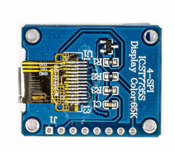
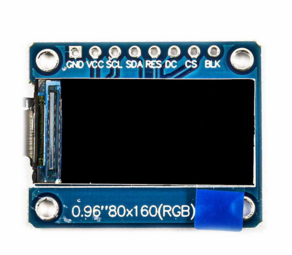
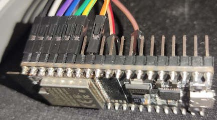
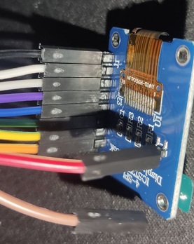
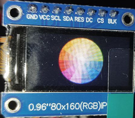
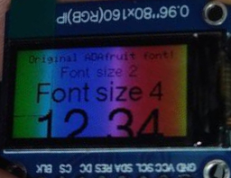

# ESP32-S2 & ST7735S 0.96" TFT LCD with Arduino + TFT_eSPI Library

This project demonstrates how to use an **ESP32-S2 (NodeMCU-32)** with a **0.96" ST7735S TFT LCD (80x160 RGB)** via 4-wire SPI, utilizing the [TFT_eSPI](https://github.com/Bodmer/TFT_eSPI) library for fast and efficient graphics rendering.

## 🛠️ Hardware

- **Microcontroller:** ESP32-S2 (NodeMCU-32)
- **Display:** 0.96" TFT LCD, ST7735S driver, 80x160 resolution, RGB
- **Interface:** 4-wire SPI

## 🔌 Wiring Diagram

| TFT Pin | ESP32 Pin |
| ------- | --------- |
| GND     | GND       |
| VCC     | VCC       |
| SCL     | GPIO 23   |
| SDA     | GPIO 22   |
| CS      | GPIO 21   |
| DC      | GPIO 3    |
| RST     | GPIO 1    |
| BL      | GPIO 19   |

> ⚠️ Double-check your ESP32-S2 board's pin availability before wiring.

### 📷 TFT module

 

### 📷 Connections

 

---

## 📚 Library

- [TFT_eSPI](https://github.com/Bodmer/TFT_eSPI) by Bodmer

### Configuration (`User_Setup.h`)

```cpp
#define ST7735_DRIVER

#define ST7735_GREENTAB160x80

#define TFT_RGB_ORDER TFT_BGR

#define TFT_WIDTH  80
#define TFT_HEIGHT 160

#define TFT_MOSI 22
#define TFT_SCLK 23
#define TFT_CS   21
#define TFT_DC   3
#define TFT_RST  1
#define TFT_BL   19

#define SPI_FREQUENCY  27000000
```

---

## 🚀 Getting Started

1. Install the [TFT_eSPI](https://github.com/Bodmer/TFT_eSPI) library from the Arduino Library Manager.
2. Edit `User_Setup.h` as shown above to match your wiring.
3. Open your sketch, select the right board and port, and upload the code.
4. You should see your display render graphics/UI as defined in your sketch.

---

## 💡 Backlight Control

You can manually control the backlight (connected to GPIO 19) like this:

```cpp
  pinMode(TFT_BL, OUTPUT);
  digitalWrite(TFT_BL, HIGH);
```

---

## ✅ Demo Output



---

## ⚠️ Notes

- Ensure your TFT operates at 3.3V logic (most ESP32 boards do).
- A white screen usually indicates a wiring issue or incorrect configuration in `User_Setup.h`.

---

## 📄 License

MIT License
